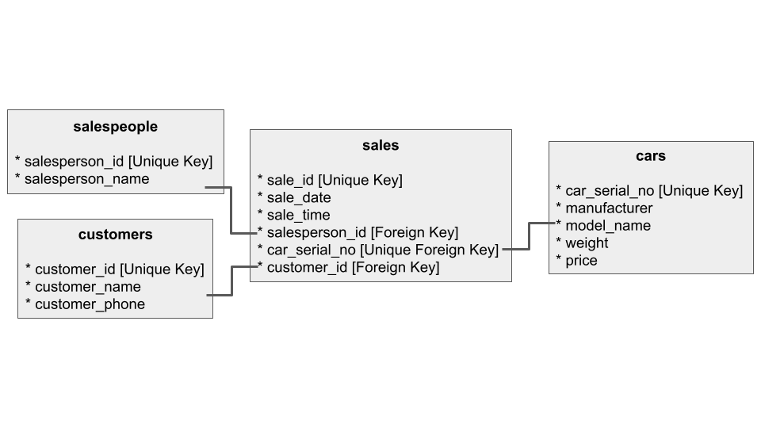
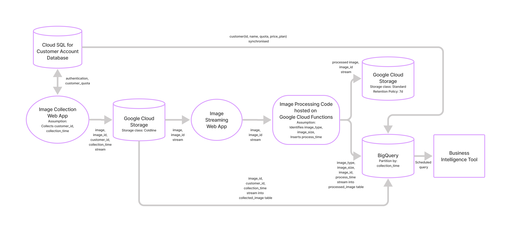
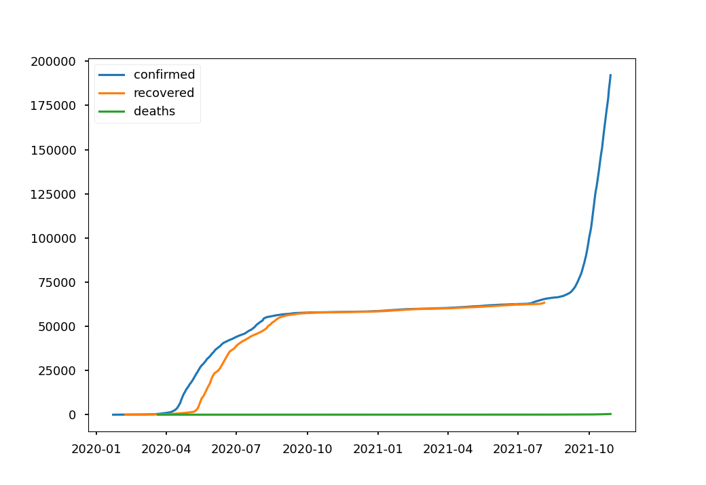
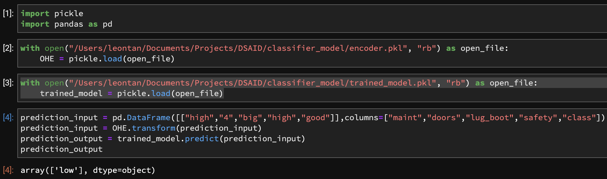

# DSAID

This GitHub repository is my submission to the DSAID Data Engineering Technical Test given to me by GovTech. I'm given 48 Hours to complete this

## Contents Section
[An Internal Link to a Section Heading](README.md#modifying-front-matter)

## Section 1: Data Pipelines
### Question Statement

The objective of this section is to design and implement a solution to process a data file on a regular interval (e.g. daily). Assume that there are 2 data files dataset1.csv and dataset2.csv, design a solution to process these files, along with the scheduling component. The expected output of the processing task is a CSV file including a header containing the field names.

You can use common scheduling solutions such as cron or airflow to implement the scheduling component. You may assume that the data file will be available at 1am everyday. Please provide documentation (a markdown file will help) to explain your solution.

Processing tasks:

* Split the name field into first_name, and last_name
* Remove any zeros prepended to the price field
* Delete any rows which do not have a name
* Create a new field named above_100, which is true if the price is strictly greater than 100
Note: please submit the processed dataset too.

### Solution
Please find the processed datasets in /output and the corresponding airflow DAG file in /dags.

*Text explaining logic behind DAG*

## Section 2: Databases
### Question Statement

You are appointed by a car dealership to create their database infrastructure. There is only one store. In each business day, cars are being sold by a team of salespersons. Each transaction would contain information on the date and time of transaction, customer transacted with, and the car that was sold.

The following are known:

Each car can only be sold by one salesperson.
There are multiple manufacturers’ cars sold.
Each car has the following characteristics:
* Manufacturer
* Model name
* Serial number
* Weight
* Price
Each sale transaction contains the following information:
* Customer Name
* Customer Phone
* Salesperson
* Characteristics of car sold
Set up a PostgreSQL database using the base docker image here given the above. We expect at least a Dockerfile which will stand up your database with the DDL statements to create the necessary tables. Produce entity-relationship diagrams as necessary to illustrate your design.

Your team also needs you to query some information from the database that you have designed. You are tasked to write a sql statement for each of the following task:

I want to know the list of our customers and their spending.

I want to find out the top 3 car manufacturers that customers bought by sales (quantity) and the sales number for it in the current month.

### Database Set-up

To begin setting up the database for the car dealership, run 
> docker-compose up

To initiate the postgres docker container
The DDL statements are included in the docker-compose

To connect to the postgres container, open a new terminal and use
> POSTGRES_CID=\`docker container ls| grep postgres_db| awk '{ print $1 }'\` && docker exec -it $POSTGRES_CID bash

Then to connect into postgres use
> psql -d postgres_db -U postgres_user

Here you can run the following sql statements after inserting in the data.

### Database Entity-Relations

The database will be constructed with the tables as per the ER diagram below, found under the folder of /database_diagram:

### SQL Statements
SQL statements for the query task given:

1:
>SELECT 
     result.customer_name, result.customer_id, SUM(c2.price)
FROM(
     SELECT 
          c.customer_name, c.customer_id,  s.car_serial_no 
     FROM 
          customers as c 
     LEFT JOIN 
          sales as s 
     ON 
          c.customer_id = s.customer_id
     ) as result 
LEFT JOIN 
     Cars as c2 
ON 
     result.car_serial_no = c2.car_serial_no
GROUP BY 
     result.customer_id, result.customer_name;

2:
>SELECT 
     c.manufacturer, COUNT(\*) 
FROM 
     sales as s 
LEFT JOIN 
     cars as c 
ON 
     s.car_serial_no = c.car_serial_no 
WHERE 
     EXTRACT(MONTH FROM s.sale_date) = EXTRACT(MONTH FROM CURRENT_DATE) AND EXTRACT(YEAR FROM s.sale_date) = EXTRACT(YEAR FROM CURRENT_DATE) 
GROUP BY 
     c.manufacturer 
ORDER BY 
     COUNT(\*) 
DESC LIMIT 3;

## Section: 3
### Question

You are designing data infrastructure on the cloud for a company whose main business is in processing images.

The company has a web application which collects images uploaded by customers. The company also has a separate web application which provides a stream of images using a Kafka stream. The company’s software engineers have already some code written to process the images. The company would like to save processed images for a minimum of 7 days for archival purposes. Ideally, the company would also want to be able to have some Business Intelligence (BI) on key statistics including number and type of images processed, and by which customers.

Produce a system architecture diagram (e.g. Visio, Powerpoint) using any of the commercial cloud providers' ecosystem to explain your design. Please also indicate clearly if you have made any assumptions at any point.

### Solution

Please find the image in the folder /system_design

*Text explaining logic behind diagram*

## Section: 4
### Question

Your team decided to design a dashboard to display the statistic of COVID19 cases. You are tasked to display one of the components of the dashboard which is to display a visualisation representation of number of COVID19 cases in Singapore over time.

Your team decided to use the public data from https://documenter.getpostman.com/view/10808728/SzS8rjbc#b07f97ba-24f4-4ebe-ad71-97fa35f3b683.

Display a graph to show the number cases in Singapore over time using the APIs from https://covid19api.com/.

### Solution

Please find the associated code and image in /sg_covid_cases

*Text explaining logic behind diagram, especially where data is NA*

## Section: 5
### Question

Using the dataset from https://archive.ics.uci.edu/ml/datasets/Car+Evaluation, create a machine learning model to predict the buying price given the following parameters:

Maintenance = High Number of doors = 4 Lug Boot Size = Big Safety = High Class Value = Good

### Solution

Please find the the model pickle file (trained_model.pkl) and prediction image (prediction.png) in the folder /classifier_model. The encoder pickle file (encoder.pkl) will be necessary in processing the inputs to the model. The .ipynb file shows the steps used to train the model.

*Text explaining logic behind diagram*

*How to use the pickle files*