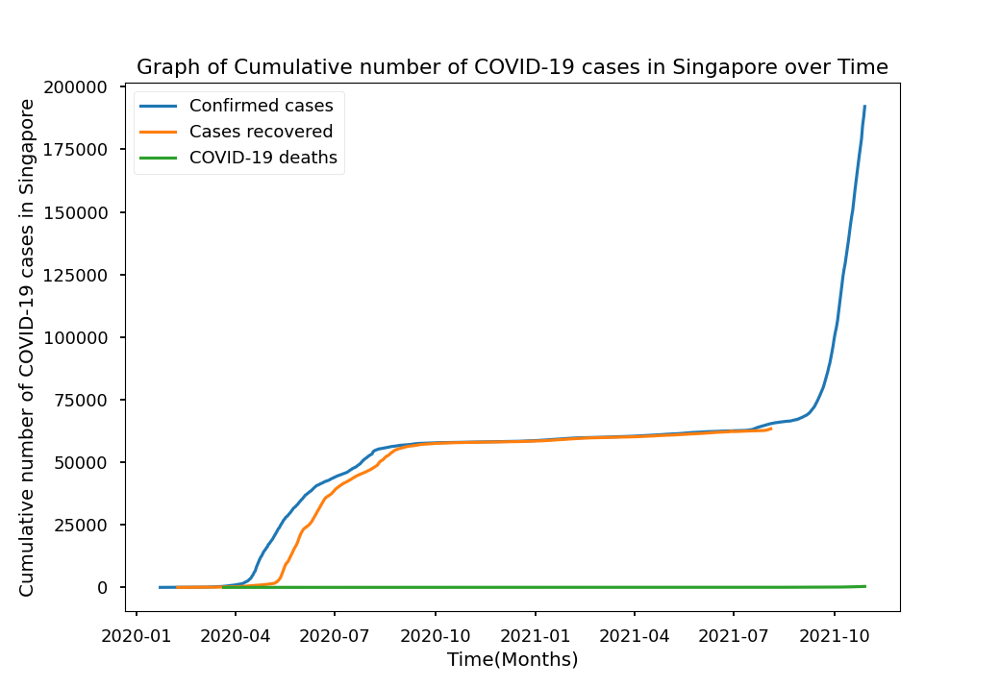

# DSAID
## Section: 1
Please find the output in /output and the corresponding DAG file in /dag

## Section: 2
The database will be constructed with the tables (and respective column names) as below:

salespeople
* salesperson_id [Unique Key]
* salesperson_name

cars
* car_serial_no [Unique Key]
* manufacturer
* model_name
* weight
* price

sales
* sale_id [Unique Key]
* sale_date
* sale_time
* salesperson_id [Foreign Key]
* car_serial_no [Unique Foreign Key]
* customer_id [Foreign Key]

customers
* customer_id [Unique Key]
* customer_name
* customer_phone

### Database Set-up
Run 
> docker-compose up
To initiate the postgres docker container

#### DDL STATEMENTS
The following 4 CREATE TABLE statements will initiate the database for the structure given aboce:

CREATE TABLE salesperson (
salesperson_id serial PRIMARY KEY,
name VARCHAR (50)
);

CREATE TABLE cars (
car_serial_no VARCHAR(50) PRIMARY KEY,
manufacturer VARCHAR(20),
model_name VARCHAR(15),
weight INTEGER,
price INTEGER
);

CREATE TABLE customers (
customer_id serial PRIMARY KEY,
customer_name VARCHAR (50),
customer_phone VARCHAR (15)
);

CREATE TABLE sales (
sale_id serial PRIMARY KEY,
sale_date DATE,
sale_time TIME,
salesperson_id INTEGER,
car_serial_no VARCHAR(50) UNIQUE,
customer_id INTEGER,
CONSTRAINT fk_salespeople
FOREIGN KEY(salesperson_id)
REFERENCES salespeople(salesperson_id),
CONSTRAINT fk_cars
FOREIGN KEY(car_serial_no)
REFERENCES cars(car_serial_no),
CONSTRAINT fk_customers
FOREIGN KEY(customer_id)
REFERENCES customers(customer_id)
);

### SQL STATEMENTS
SQL statements for the query task given:

1:
SELECT 
     result.customer_name, result.customer_id, SUM(c2.price)
FROM(
     SELECT 
          c.customer_name, c.customer_id,  s.car_serial_no 
     FROM 
          customers as c 
     LEFT JOIN 
          sales as s 
     ON 
          c.customer_id = s.customer_id
     ) as result 
LEFT JOIN 
     Cars as c2 
ON 
     result.car_serial_no = c2.car_serial_no
GROUP BY 
     result.customer_id, result.customer_name;

2:
SELECT 
     c.manufacturer, COUNT(*) 
FROM 
     sales as s 
LEFT JOIN 
     cars as c 
ON 
     s.car_serial_no = c.car_serial_no 
WHERE 
     EXTRACT(MONTH FROM s.sale_date) = EXTRACT(MONTH FROM CURRENT_DATE) AND EXTRACT(YEAR FROM s.sale_date) = EXTRACT(YEAR FROM CURRENT_DATE) 
GROUP BY 
     c.manufacturer 
ORDER BY 
     COUNT(*) 
DESC LIMIT 3;

## Section: 3
Please find the image in /system_design

## Section: 4
Please find the associated code and image in /sg_covid_cases

## Section: 5
Please find the the model pickle file (trained_model.pkl) and prediction image (prediction.png) in /classifier_model. The encoder pickle file (encoder.pkl) will be necessary in processing the inputs to the model. The .ipynb file shows the steps used to train the model.

