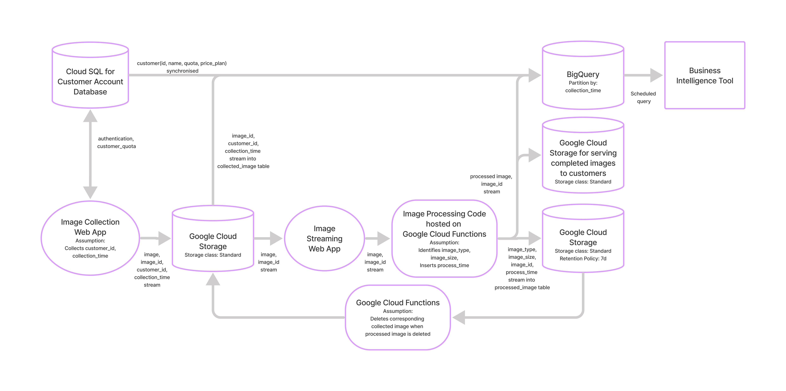

# DSAID

This GitHub repository is my submission for the DSAID Data Engineering Technical Test from GovTech. If you have questions or doubts, you can direct them to my email at tkokhow@gmail.com.

## Contents Section
* [Section 1: Data Pipelines](https://github.com/leontkh/DSAID#section-1-data-pipelines)
* [Section 2: Databases](https://github.com/leontkh/DSAID#section-2-databases)
* [Section 3: System Design](https://github.com/leontkh/DSAID#section-3-system-design)
* [Section 4: Charts and APIs](https://github.com/leontkh/DSAID#section-4-charts-and-apis)
* [Section 5: Machine Learning](https://github.com/leontkh/DSAID#section-5-machine-learning)
* [Afterword](https://github.com/leontkh/DSAID#afterword)

## Section 1: Data Pipelines
### _Key files_

Please find
* The processed datasets in [/output](https://github.com/leontkh/DSAID/tree/master/output) 
* The airflow DAG file that processed the datasets in [/dags](https://github.com/leontkh/DSAID/tree/master/dags).

### _Steps to get started_

This solution leverages on Apache Airflow. To begin, set environment variables by opening a terminal. 
1. Set `CSV_INPUT_PATH` as the input location for dropping .csv files to be processed
e.g. `CSV_INPUT_PATH=/file/path/to/the/input/folder/`
2. Set `CSV_OUTPUT_PATH` as the output location for the processed .csv files to be saved.
3. After setting these two environment variables, set up and initiate Airflow.

After setting up [Airflow](https://airflow.apache.org/docs/apache-airflow/stable/start/docker.html) at the root of this directory, Airflow's scheduler should recognise the cron statement in the DAG's `schedule_interval` parameter, running the DAG every 1:01am. When activated, the DAG iterates through each .csv file at the `CSV_INPUT_PATH` location and processes each of them. 

### _What the DAG does_

For each .csv file, the DAG runs the following processes on the .csv's data:

* Deleting any rows which do not have a `name`
* Removing titles from the `name` field e.g. Mr., Dr.
* Separates the remaining name by spaces
* Picks out the first two parts and puts them into `first_name` and `last_name` respectively
* Discards the rest of the name to drop titles at the end of names e.g. MD
* Remove any zeros prepended to the `price` field by changing data type to float
* Create a new field named `above_100`, which is true if the `price` is strictly greater than 100

## Section 2: Databases
### _Database entity-relations_

The database I will propose for car dealership will be constructed with the tables as per the ER diagram below, found under the folder of [/database_diagram](https://github.com/leontkh/DSAID/tree/master/database_diagram):

Sales transactions relate to a salesperson, a car and a customer and so is made into the central table that connects each of these information together. 

### _Database set-up_

To begin setting up the database for the car dealership, run 
>docker-compose up

To initiate the Postgres docker container
The DDL statements are included in `docker-compose.yml`

To connect to the postgres_db container, open a new terminal and use
>POSTGRES_CID=\`docker container ls| grep postgres_db| awk '{ print $1 }'\` && docker exec -it $POSTGRES_CID bash

Then to connect into Postgres from the postgres_db container, please use
>psql -d postgres_db -U postgres_user

Here you can run the SQL statements in the next section after filling the tables with data.

### _SQL statements_

SQL statements for the query task given:

1:
>SELECT 
     result.customer_name, result.customer_id, SUM(c2.price)
FROM(
     SELECT 
          c.customer_name, c.customer_id,  s.car_serial_no 
     FROM 
          customers as c 
     LEFT JOIN 
          sales as s 
     ON 
          c.customer_id = s.customer_id
     ) as result 
LEFT JOIN 
     Cars as c2 
ON 
     result.car_serial_no = c2.car_serial_no
GROUP BY 
     result.customer_id, result.customer_name;

2:
>SELECT 
     c.manufacturer, COUNT(\*) 
FROM 
     sales as s 
LEFT JOIN 
     cars as c 
ON 
     s.car_serial_no = c.car_serial_no 
WHERE 
     EXTRACT(MONTH FROM s.sale_date) = EXTRACT(MONTH FROM CURRENT_DATE) AND EXTRACT(YEAR FROM s.sale_date) = EXTRACT(YEAR FROM CURRENT_DATE) 
GROUP BY 
     c.manufacturer 
ORDER BY 
     COUNT(\*) 
DESC LIMIT 3;

## Section 3: System Design
### _Key files_

Please find the below system architecture diagram in the folder [/system_design](https://github.com/leontkh/DSAID/tree/master/system_design):

### _Assumptions made_

* Image collection web app and image stream web app has been incorporated into a full flow from image collection, image processing finally delivery of completed image
* The full process flow is hosted by the Google Cloud Platform ecosystem. 
* When customer access the image collection web app, authentication is required for billing and identification purposes
* Image collected are stored in blob storage in Google Cloud Storage before image stream web app pass it downstream
* Image collected are stored in blob storage is kept for archival purposes as well in order to compare with the archived processed image
* Image processing code is hosted on Google Cloud Functions for minimum additional code
* Processed image is sent to a Google Cloud Storage to serve the customers
* Throughout the image processing, messages are sent to BigQuery for analytics
* BigQuery are programmed with scheduled queries to collect key statistics
* Scheduled query results are sent to Business Intelligence tools for visualization

## Section 4: Charts and APIs
### _Key files_

The SG COVID-19 cases graph below can be found at [/sg_covid_cases](https://github.com/leontkh/DSAID/tree/master/sg_covid_cases). The associated Python file is also included in the same folder.

### _API calls and graph plotting_

The Python file accesses the API endpoint 3 times, each time calling for a different set of data. These are: 

* the cumulative number of confirmed cases
* the cumulative number of recovered cases
* the cumulative number of COVID-19 deaths

before plotting the graph out in the same axis.

The cumulative number of `recovered` cases drop to `0` around August 2021. I suspect that the SG government may have changed their data format, resulting in the endpoint not collecting any data. As a result, I made the decision to change the `0` values to `NaN` values so the the graph cuts off when its no longer relevant.

## Section 5: Machine Learning
### _Key files_

The machine learning model can be found in the folder [/classifier_model](https://github.com/leontkh/DSAID/tree/master/classifier_model) in the form of a pickle file `trained_model.pkl`.

The encoder required to processing the inputs to the model are also available in the form of a pickle file `encoder.pkl`.

The folder also includes `cars_processing.ipynb`, outlining how the machine learning model is selected and trained.

`prediction.png` in the same folder illustrates the Python code to use the model and the capability of the model in predicting a buying price given the parameters:
>Maintenance = High Number of doors = 4 Lug Boot Size = Big Safety = High Class Value = Good

## Afterword

I would like to have written a way to automate the Airflow set-up process for Section 1. However, my current computer does not possess sufficient memory to run Airflow in Docker and I am unable to check the effectiveness of my DAG file.

Overall, this Technical Test has been a fun challenge. Typically I would receive algorithm challenges or SQL tests as technical tests, but this is the first time I've seen a test so comprehensive. Along the way I've learnt to utilise the syntax for markdown more, and would definitely use this to make my README.md more readable in future projects.